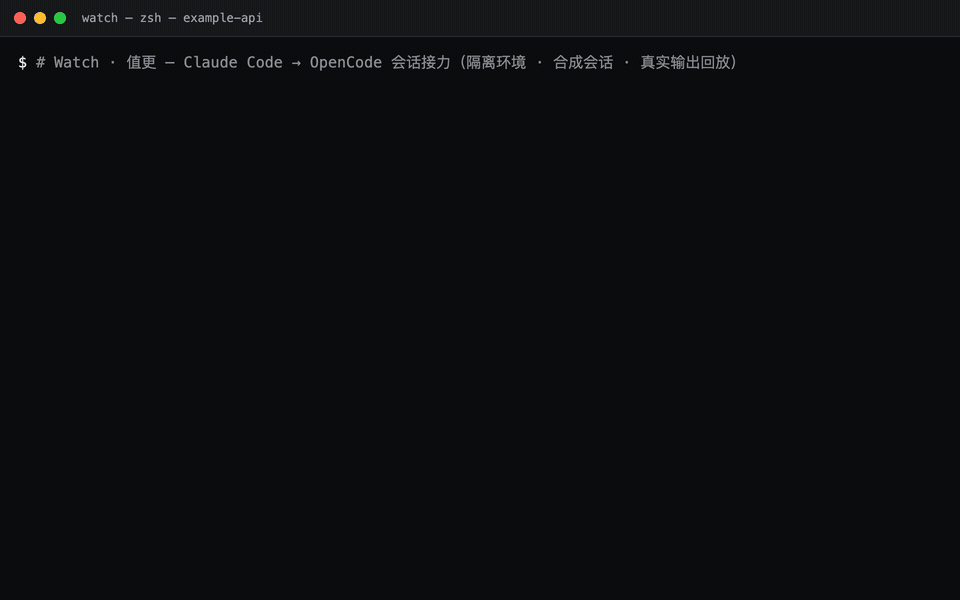
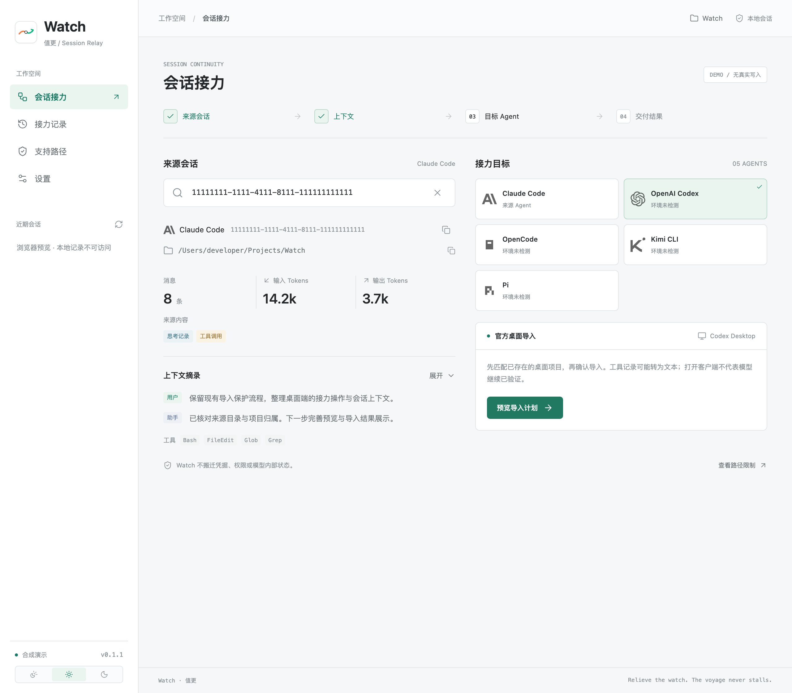
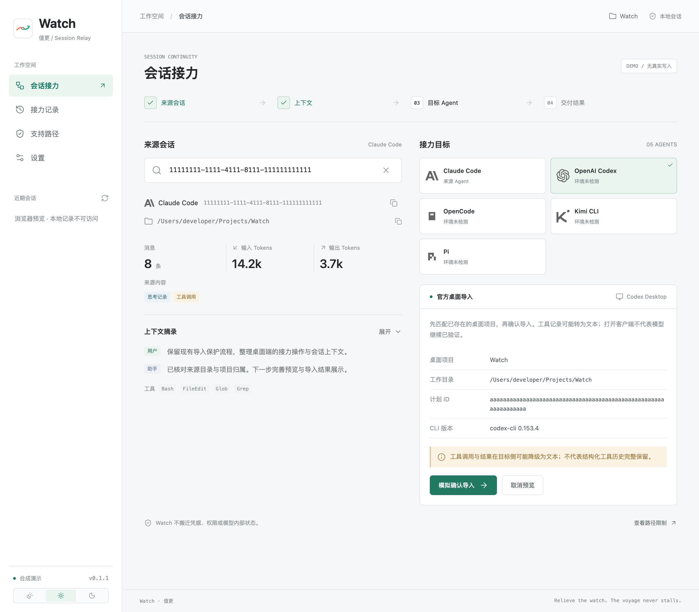
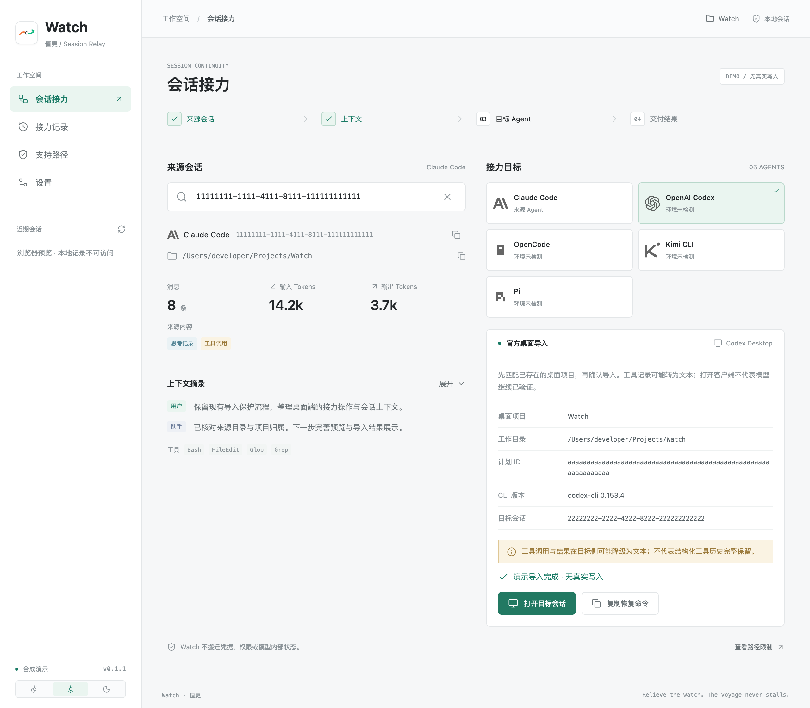
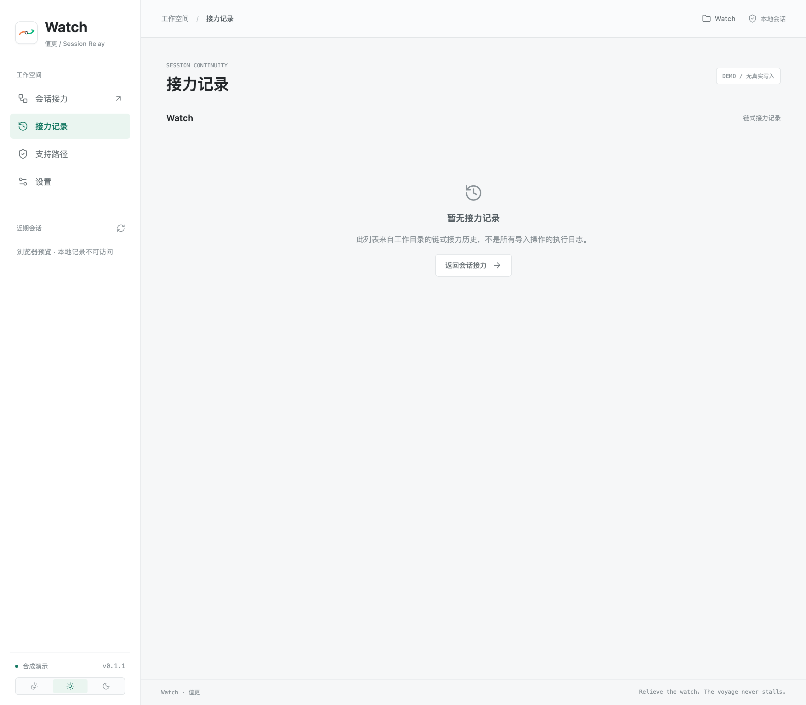
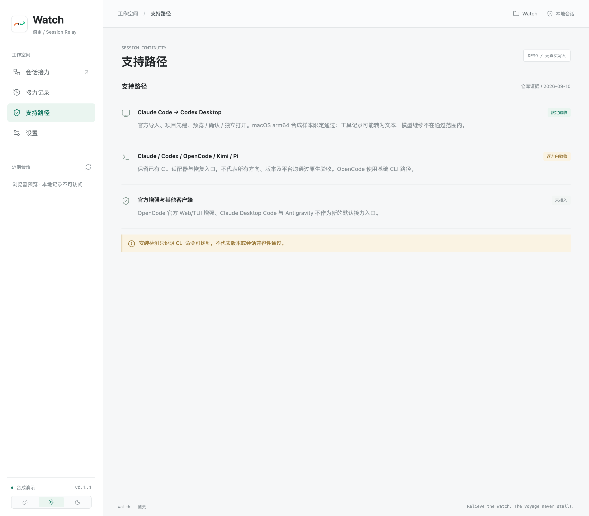
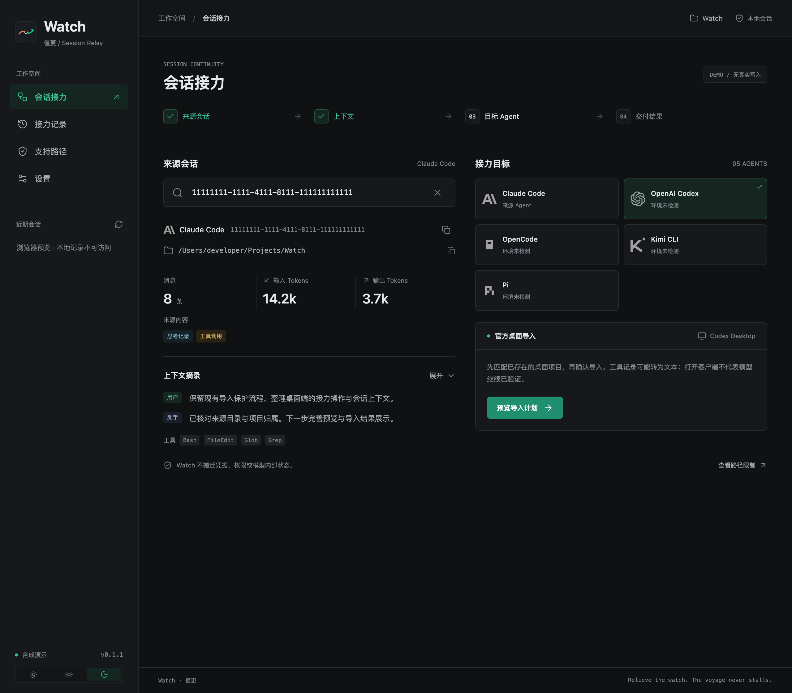

<div align="center">
  
  <h1>Watch · 值更</h1>
  <p><b>Relieving the watch. The voyage never stalls.</b></p>
  <a href="https://github.com/can4hou6joeng4/Watch/stargazers"></a>
  <a href="https://github.com/can4hou6joeng4/Watch/releases"></a>
  <a href="LICENSE"></a>
  
  <br>
  <a href="README.md">中文</a> · Website <a href="https://relay.bobochang.cn/en/">relay.bobochang.cn/en</a> · Part of <a href="https://github.com/can4hou6joeng4/Homeport">The Fleet</a>
</div>

## Why

When the current agent hits its limit, the context window fills up, or an investigation stalls and you want to switch tools, the conclusions, failed attempts and tool history all stay behind in the old tool. Restating that context is expensive, and it is easy to drop a constraint that mattered.

Watch does one thing: **carry the saved session record and the working directory into a target tool so the same work continues.**

It does not provide models, bypass usage limits, replace native agent chat, or move permissions, credentials and plugins by default. What it transfers is the recorded session, not the model's unrecorded internal state. Today the implementation is centred on CLI sessions and terminal resume; the product direction includes validated desktop entry points, but **official interoperability does not mean Watch has integrated it**.

## Showcase

The images below were generated from synthetic sessions in an isolated environment and show real program output. They are **not native acceptance evidence**; see [assets](assets/README.md) for how they were produced and their limits.

<table>
<tr>
  <td align="center" colspan="3">
    
    <br><b>CLI handoff</b> · Claude Code → OpenCode
    <br><sub>status → sessions → switch opencode → status, replayed with original timing</sub>
  </td>
</tr>
<tr>
  <td align="center" width="33%" valign="top">
    
    <br><b>Source session</b> · cwd and context lookup
    <br><sub>Session ID, working directory, usage and tool traces</sub>
  </td>
  <td align="center" width="33%" valign="top">
    
    <br><b>Import preview</b> · read-only before confirm
    <br><sub>Desktop project, cwd, CLI version and plan ID</sub>
  </td>
  <td align="center" width="33%" valign="top">
    
    <br><b>Import complete</b> · then open separately
    <br><sub>Target thread is kept; a failed open is only retried, never re-imported</sub>
  </td>
</tr>
<tr>
  <td align="center" width="33%" valign="top">
    
    <br><b>Handoff history</b> · empty state
    <br><sub>This list is the directory's chained handoff history, not an import execution log</sub>
  </td>
  <td align="center" width="33%" valign="top">
    
    <br><b>Supported routes</b> · evidence boundary per direction
    <br><sub>Limited pass / per-route validation / not integrated</sub>
  </td>
  <td align="center" width="33%" valign="top">
    
    <br><b>Dark appearance</b> · light / dark / system
    <br><sub>Preference stored locally</sub>
  </td>
</tr>
</table>

## Install

Requires a Node that can run `node:sqlite` and tsx (**≥ 22.13**), plus whichever agent CLIs you actually use. The desktop app additionally needs a Rust / Tauri toolchain.

**Desktop installers**: take the current platform's package from [Releases](https://github.com/can4hou6joeng4/Watch/releases). The packaged app still relies on an external Node on the user's machine.

**From source**

```bash
npm install                                  # repository root
npm --prefix desktop install                 # desktop dependencies are separate

npm run watch -- status --json               # use the CLI directly
npm run desktop:dev                          # run the desktop app locally (Vite on 1420)
npm --prefix desktop run build               # build the desktop frontend
cd desktop && npx tauri build                # package the current platform
```

More conventions (code style, test isolation, commit format) are in the [contributing guide](CONTRIBUTING.md).

## Usage

1. Get the session ID from the native agent and paste it into Watch.
2. Check the detected source agent and project directory. **If detection fails, do not simply resume it as another tool.**
3. Continue the original session with the source agent, or hand off to another agent. Selecting a target writes nothing by itself; the target may be a new session, or an existing matching session extended with the delta.
4. Continue in the chosen terminal, or choose "copy command only" and run it yourself. A failed terminal launch falls back to copying.

Common commands (all accept `--json`; success and failure both print a single-line JSON to stdout, diagnostics go to stderr):

```bash
npm run watch -- status --json                  # sessions, chain tip and switch history for this directory
npm run watch -- sessions --json                # native sessions of every agent in this directory
npm run watch -- switch codex                   # hand the chain tip over to Codex, print the resume command
npm run watch -- adopt claude                   # attach an existing Claude session to the chain
npm run watch -- new pi                         # create the other side of the chain (starts a session on an empty chain)
npm run watch -- open <session-id> --json       # resolve the cwd and print a paste-ready command
npm run watch -- open <session-id> --to codex   # transfer that session into a new Codex session
```

<details>
<summary>All CLI subcommands</summary>
<br>

```text
status   [--cwd <path>] [--chain <id|name>]     sessions, chain tip and switch history
sessions [--cwd <path>] [--chain <id|name>]     native sessions per agent in this directory
switch   <provider>                             hand the chain tip to the target provider
adopt    <provider> [--session <id>]            attach an existing native session to the chain
new      <provider>                             create the other side of the chain
chain    list|new|rename|archive|use            manage and select chains
search   <query>                                local full-text search (FTS5)
usage    [--cwd <path>] [--chain <id|name>]     token usage per session on the chain
recent   [--json]                               recently resolved sessions
providers                                       local install detection per agent
open     <session-id> [--from <id>] [--provider <name>] [--to <provider>]
import-codex  prepare|confirm|status|project-prepare|project-confirm|project-status
```

</details>

The desktop app has four views — **session handoff, handoff history, supported routes, settings** — with light, dark and system appearance. A browser preview never reads local agent records; "load demo" uses synthetic fixtures without session writes, client launches or model requests.

YOLO is off by default. Enabling it adds no-confirmation flags to the CLI commands it supports, which relaxes the target agent's permissions or sandbox; it is not a desktop permission setting.

**Claude Code → Codex Desktop (official single-session import)**

Nothing is submitted until you explicitly confirm, and the target thread is opened separately after a successful import. To land in a desktop project, the folder must already be added and kept in Codex Desktop, then `--desktop-project` is used at the prepare stage.

```bash
npm run watch -- import-codex prepare <claude-id> --cwd /absolute/project --desktop-project --experimental --json
npm run watch -- import-codex confirm <plan-id> --experimental --json
npm run watch -- import-codex status <plan-id> --json
```

The legacy `project-prepare` / `project-confirm` / `project-status` commands can still inspect or update the app-server `projectId`, but they cannot clear a persisted Desktop `projectless` exclusion and are not a project-list repair. Do not repeatedly remove the project or reimport the same session as a refresh mechanism — that changes the project ID and can leave the target excluded.

## Capabilities and limits

| Entry point | Current status |
|---|---|
| Claude Code, Codex, Kimi, OpenCode, Pi CLI | Lookup, conversion and resume are implemented; OpenCode supports SQLite session resume with path isolation and native ID fixes, but specific versions and directions still need validation |
| Grok CLI | Kernel adapter retained; no desktop target card |
| Codex Desktop | The Claude Code source is wired into the project-first preview, confirm, status and independent open flow; synthetic samples passed a real Watch Tauri click-through and two opens of the same target. The local CodexPilot continuation attempt is still recorded as 503 |
| Claude Desktop Code | The official `/desktop` flow has been investigated; it depends on the current CLI session being saved and flushed, and is neither integrated nor natively validated by Watch |
| OpenCode Web, TUI, IDE | On Darwin arm64 / 1.18.29, official JSON import/export, the read-only server API, Web, a standalone local TUI and an attached TUI all showed the same history in isolated native validation; a single no-tool continuation request produced no reply due to provider 429, so the multi-client enhancement is not integrated. This does not block the existing OpenCode CLI card; the IDE extensions reuse the integrated terminal |
| Antigravity | The 2.0 → CLI official interactive picker has been reviewed but not natively validated; there is no cross-agent import protocol or Watch adapter |

**Historical formats, attachments and tool events may degrade**, and the result reporting still needs work. Whole-file replacement has atomic writes and partial round-trip verification, but append paths are not equivalently protected; **zero damage is not promised**. Watch does not create worktrees automatically, does not move code, and does not guarantee identical behaviour across models.

The official route binds the target directory/configuration and uses a Watch import lock, and **an unrelated running desktop app is not a reason to quit**; the original direct-file converters keep their older protection, and the two routes differ in coverage. Native evidence covers only synthetic fixtures and idle-server coexistence on macOS arm64 with Codex CLI 0.153.4, while the real Tauri click-through additionally binds ChatGPT Desktop 26.903.61454 — neither covers every concurrent workload, other versions, or model continuation.

Opening and continuing are two different states: when a handoff succeeds but the client fails to open, only opening is retried, never the transfer.

## Design

- **TypeScript carries the business logic**; Rust only bridges the CLI and performs system operations that must come from a GUI process.
- **One adapter per agent** (`src/providers/<id>/`); the unified timeline is produced and written back at the adapter boundary.
- **Three write-safety layers**: target fingerprint comparison before writing (TOCTOU), same-directory atomic writes, and parse-back verification before rename.
- **Two official routes stay isolated**: the Codex official import and the OpenCode official enhancement use their own execution journal and target lock instead of the converters above.
- **Degradation must be disclosed**: every "failed but continued" branch is recorded in warnings or findings rather than silently dropping content.

Details and protection gaps are in [architecture and safety boundaries](docs/ARCHITECTURE.md).

## Origin

Coding agents each keep their own session records. Switching tools should be routine, but every switch means restating the background: the earlier conclusions, the attempts that failed, and the constraints already established all stay behind in the old tool — and those are exactly the parts that are hardest to restate.

So Watch does not aggregate, does not proxy, and does not add another chat layer. It tries to make one segment solid: the handoff of "existing record + working directory". Findable first, verifiable next, protected on write, and continuable after delivery.

## Environment and privacy

Session conversion mostly handles local records, but it is **not an entirely offline workflow**: creating a Kimi session invokes its CLI, some Codex execution paths may read authentication configuration and call a model, and the target agent communicates under its own service rules when you continue.

Paths that invoke a native agent require it to be properly authenticated. Validate with a dedicated test session first, and never commit real credentials, chat content or agent databases to the repository.

## Documentation

- [Product requirements and implementation plan](docs/PLAN.md): scope and completion criteria.
- [Client compatibility evidence](docs/COMPATIBILITY.md): official sources, implementation status, and local preflight.
- [Architecture and safety boundaries](docs/ARCHITECTURE.md): implementation and gaps.
- [Codex official import guide](docs/import-codex.md): full flow and limits of the experimental route.
- [Contributing guide](CONTRIBUTING.md) (written in Chinese): environment, code style, test isolation and commit format.

## Support

- If Watch is useful to you, a star helps, and so does [sharing it with anyone who keeps switching between agents](https://twitter.com/intent/tweet?url=https://github.com/can4hou6joeng4/Watch&text=Watch%20-%20local%20session%20handoff%20for%20coding%20agents).
- For problems or new routes, open an issue or a PR; please read the [contributing guide](CONTRIBUTING.md) first.

## License

Code and documentation in this repository are released under [MIT](LICENSE).

- Site icons come from [Lucide](https://lucide.dev) (ISC). The agent icons under `site/agents/` and `desktop/public/` are each brand's own asset and are used for identification only.
- Desktop installers bundle `tsx` and `esbuild` (both MIT) into `watch-core`; running the app still requires Node ≥ 22.13 on the user's machine.
- Each agent CLI is bound by its own license and terms of service; Watch does not redistribute their models or credentials.

---

## ⚓ The Fleet

| Ship | Idea | Route |
|---|---|---|
| 🧭 [Homeport](https://github.com/can4hou6joeng4/Homeport) | Home port | Personal site · fleet base |
| **⏱️ Watch** | **Watch** | **Cross-CLI coding-agent session relay** |
| 🗺️ [Atlas](https://github.com/can4hou6joeng4/Atlas) | Chart | AI coding usage menu-bar app |
| 🐋 [Sonar](https://github.com/can4hou6joeng4/Sonar) | Sonar | Cover-art colour driven iOS music player |
| 🚩 [Semaphore](https://github.com/can4hou6joeng4/Semaphore) | Semaphore | Local browser ASCII art converter |
| 🛟 [Buoy](https://github.com/can4hou6joeng4/Buoy) | Buoy | AnyRouter multi-account check-in tool |
| 🗼 [Beacon](https://github.com/can4hou6joeng4/Beacon) | Beacon | PDF credential expiry audit |
